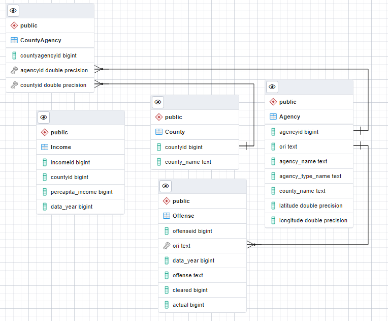
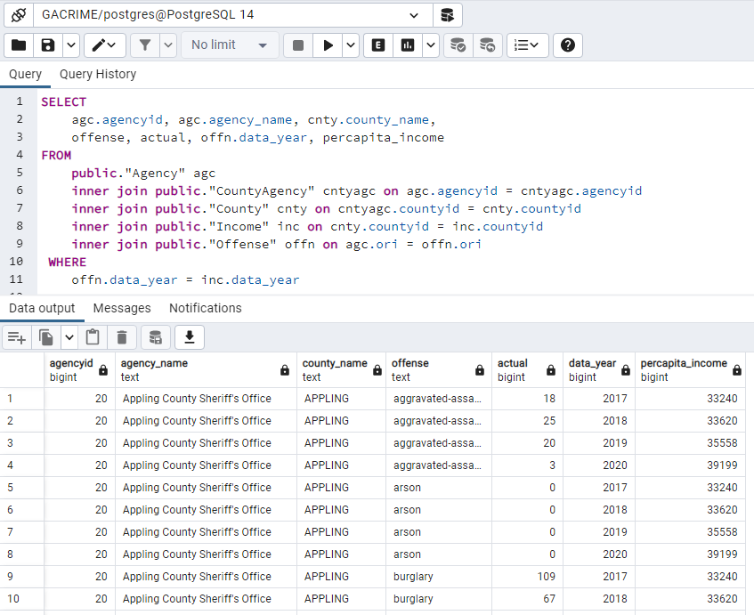
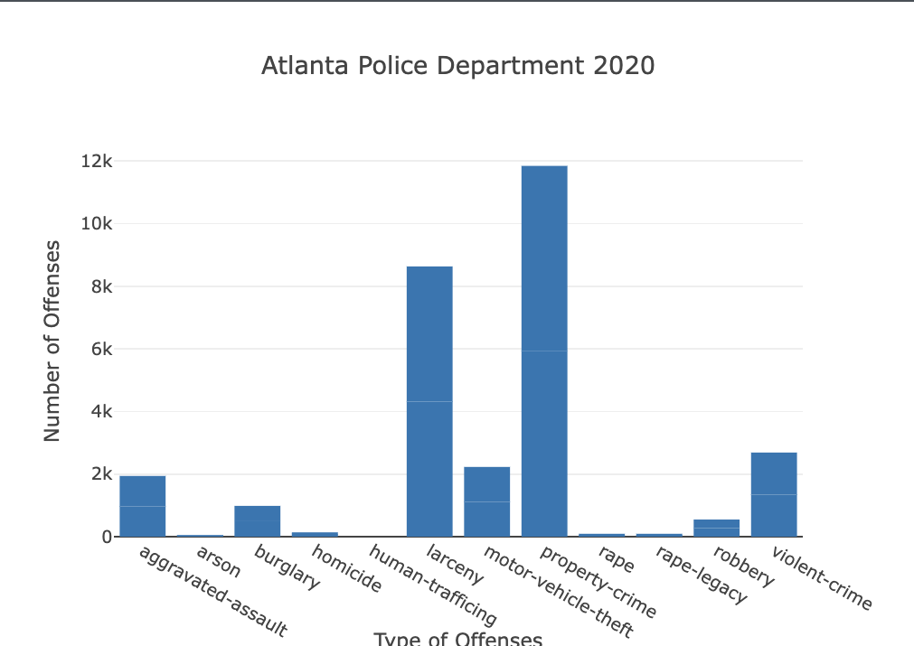

# Project-Group-D
## Group Participants
* Joe Johnson
* Jenny Bedwell
* John McMullan
* Huda Alghazouli
* Hwa Hara
* Sarje Page
* Chloe Stitik
* Lennox Nguyen
* Diana Lam

## Data Sources
* "Federal Bureau of Investigation - Crime Data Explorer" API Call on <a href = "https://crime-data-explorer.fr.cloud.gov/pages/explorer/crime/crime-trend">Crime Data</a>
* "FRED - Federal Reserve Economic" Dataset <a href = "https://fred.stlouisfed.org/release/tables?rid=175&eid=266512">Median Household Income</a> 
* "U.S. News and Money Report" Article <a href = "https://money.usnews.com/money/personal-finance/family-finance/articles/where-do-i-fall-in-the-american-economic-class-system">Income Group Chart</a>

## Overview
Georgia has been in the news a lot in the last few years especially due to the recent up surge of crimes. As some of us are residents of Georgia, we are aware that most of these crimes are confined to certain counties of Georgia but to truly understand the true nature of these crimes, we decided to dig deeper into the Georgia county data available from our data sources by looking at the average income of each of the counties and see its correlation with crime.

With ORI (Originating Agency Identifier) of the Georgia law enforcement system, we will be able to extract different crime data from 2017 to 2020 inside Georgia. By utilizing different data sources, Jupyter notebook, Leaflet, Plotly, Postgres SQL, HTML/CSS, JS, and LoDash (the unintroduced JS library), we analyze the GA county crimes and the median household income to show:

* Index Page with the summary of the project
* Dashboard with bar charts for each year (2017-2020)
* Dashboard with line charts to show trend of Median Income of County and Total Crime
* Dashboard with bubble graph to show relative difference of each crime category for selected year
* Leaflet page with the map that has median household income data and crime data with filtered checkboxes

## Rough Breakdown of Data and Data Delivery
### Extract: indicates the original data sources and how the data were formatted at a professional level
Initially, the team thought it would be cool to compare the types of crimes against the median household income in the country, but we quickly realized the goal was not just to compare the data but also to gather data and join the data. After establishing our project objectives, we googled different APIs and websites, trying to find readily available data. We first found the crime-data explorer.fr.cloud.gov API that broke down the crime agencies by state. What this was able to show us was the granular detail of the agency name, state, and ORI for each crime agency. We knew the next big goal was to try to find other data that would have some similarities to the crime data that we could join. Further research landed us on a website with tables for the annual median household income by state. In addition, we referred to the national incident-based reporting system to bring detailed, incident-based data for our crime data. Because our data was expansive, and in some cases not complete for all years, our team decided to focus on only the state of Georgia.

### Transform: explains what data clearing or transformation was required at a professional level
After data was pulled from the APIs and loaded into our data frames, certain columns were dropped so that the data contained only the information relevant for the analysis on crimes based on county, agency, per capita income, and criminal offense. Dropped columns included identifiers such as: “DORMANT_FLAG,” “POPULATION_GROUP_CODE,” and “NIBRS_START_DATE”. We chose to focus on crime agencies and their respective criminal offenses from 2017 through 2020. The data tables were ensured to have columns aligned to execute table joins via queries.

### Load: explains the final database, tables/collections, and why the topic was chosen at a professional level
To create the Quick DBD, we had to identify and relate the columns from the Crime Data and Median Household Income Data.



Finally, we had to build SQL Database using PostgreSQL, import data, and then execute table joins via query.



## Analysis & Visualizations
### The Index Page with the summary of the project
Below, our team made a landing page, explaining the overview and showing the visualizations, which will be explained later.


### Data Dashboard Selection
Our dropdowns allow for users to choose any particular GA Law Enforcement Agency and a year between 2017-2020. For our project, we chose the Atlanta Police Department.


With each selection of the year and GA Law Enforcement Agency, we are able to get the County Name, median income, and the number of incidents of both violent and property crimes within the selected year. Provided below is Dekalb County's crimes for 2017.


### Data Dashboard with bar charts for each year (2017-2020)
Based on the data dashboard selection, provided below is the bar chart, describing Atlanta Police Department's number of classified criminal offenses in 2020.



### Data Dashboard with line charts to show trend of Median Income of County and Total Crime
Based on the data dashboard selection, provided below is the line graph, containing the total number of crimes from 2017 to 2020, reported by the Atlanta Police Department.


In addition, based on the data dashboard selection, provided below is the line graph, showing the median income of Dekalb County from 2017 to 2020.


### Data Dashboard with bubble graph to show relative difference of each crime category for selected year
As a result of choosing Fulton County Police Department and the year 2019, provided below is the bubble graph, showing relative difference of each crime category.


### LoDash Library for the Data Map
We imported the Lodash library to make the map possible, specifically the find index function:
```
(_.findIndex(crimedct, {loc: (countydata[i].agency_name)})
```
Then, "FindIndex" finds the index number of where the data matches to another dictionary.
```
combined[1].countycolor
```
This helped link specific data to our counties and departments.
```
combined[_.findIndex(combined, {cty: _.toUpper(Feature.properties.NAME)})].countycolor,
```
### Leaflet page with the map that has median household income data and crime data with filtered checkboxes
Listed below is the map layout with layers describing groups of features, which represents the real-world entities, such as street map, counties, and departments. In addition, the legend defines the map's features and permits a better understanding of the map.


If a certain department is clicked, in this case we chose Woodstock Police Department, provided below is the following information:


Then, when a certain county is clicked, in this case we chose Forsyth County, listed below is the following information:


## Conclusions
### Data Dashboard Trends
* Based on the line charts above, the most common trend we see from 2017-2020 is that the total number of crime offenses reported had significantly decreased while the median income over the years has steadily increased. Assuming from our observations, the pandemic lockdowns possibly tied to lower crime for the year 2020 in many places, not just Georgia, because of the stay-at-home policies put into effect.
* With the data gathered, we cannot correlate higher median income to lower crime rate due to outliers, such as the pandemic and the US inflation rate. To have a more convincing trend, we need more data that included pre and post pandemic years, as well as population information for each county.

### Leaflet Data Map Trends
* Solved rates do not follow evenly with median income. As median income increases, we either see solved rate percentages neither increase nor decrease.
* Population centers create more consistent data. Departments with nulls are less common in major metropolitan areas while rural areas show more departments with null values.
* Solved rates get worse around higher populations. Basically, more crimes committed create a lower solved rate.


